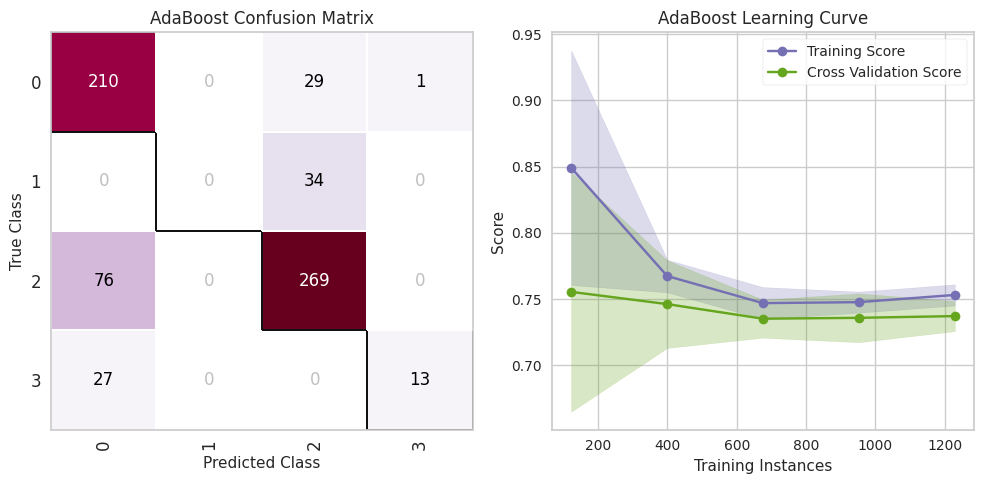
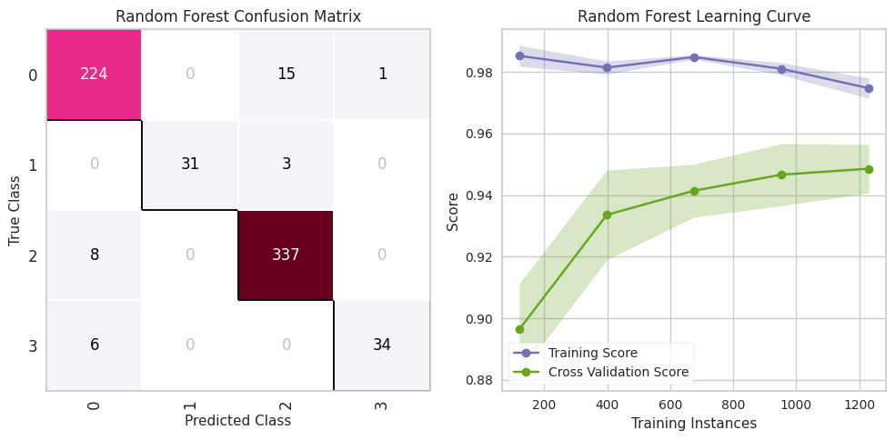
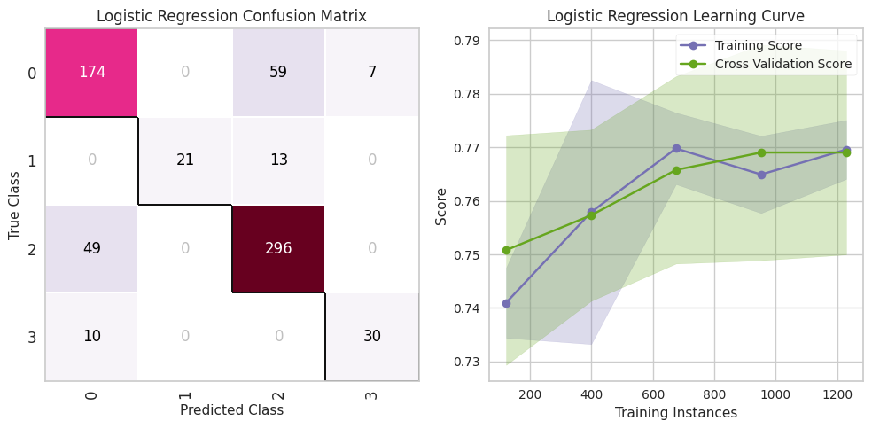
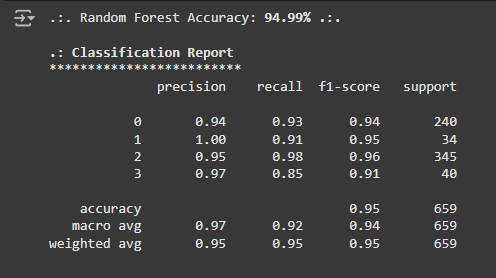

# comparisonMLmodel
This project aims to compare three popular modeling algorithms-Random Forest, Logistic Regression, and Adaboost-in predicting factors that influence the Human Development Index (HDI). 
Using a dataset covering a wide range of socio-economic, health, and education variables, this study aims to evaluate the performance of each model in identifying and predicting the elements that contribute to the HDI score.
# Adaboost Performance Visualization

# Random Forest Preformance Visualization

# Logistic Regression Prefomance Visualization

In this project, the results obtained are Random Forest is the best model with 94.99% accuracy.
# Random Forest Confusion Matrix

